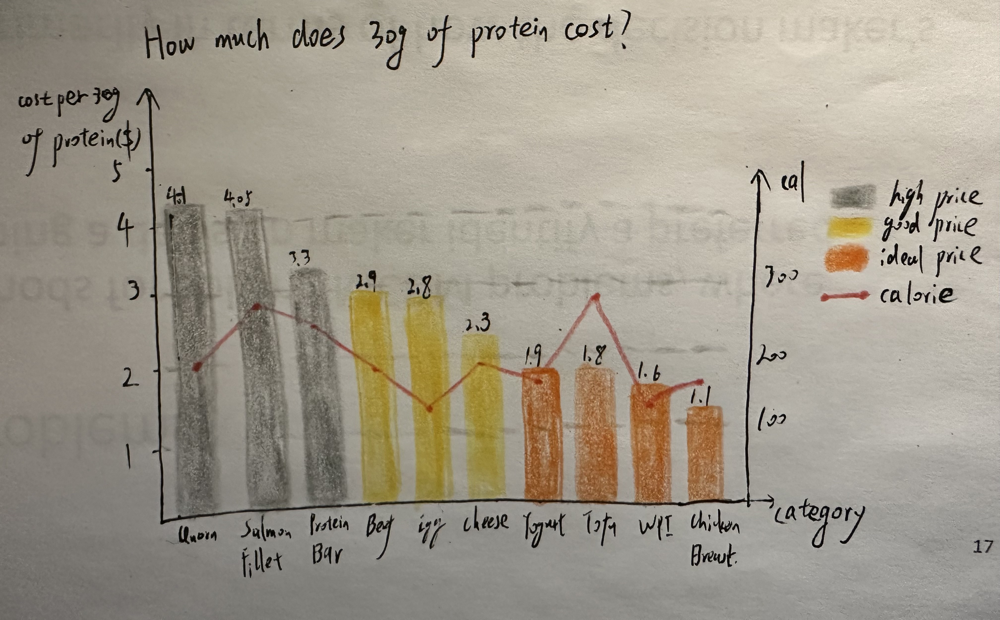

| [home page](https://cmustudent.github.io/tswd-portfolio-templates/) | [visualizing debt](visualizing-government-debt) | [critique by design](critique-by-design) | [final project I](final-project-part-one) | [final project II](final-project-part-two) | [final project III](final-project-part-three) |

# Assignment 3 & 4: Critique by Design with Tableau (MakeoverMonday)
## Step one: choose a data visualization from MakeoverMonday
Source: [The Cheapest Ways to Get Your Protein](https://data.world/makeovermonday/2023w8)

This article delves into various cost-effective protein options. 
I selected this dataset because, in my daily life, I prioritize consuming healthy, high-quality, and budget-friendly foods. I find this data valuable for understanding how to choose daily meals that provide ample protein while being cost-effective. My goal is to share this valuable information with the public so that more people can benefit from it.

Original Visualization:

## Step two: critique the data visualization

### 1. What I find works well and stands out to me
   
   (1) Title. The title effectively communicates the content of the chart.

   (2) Bar Chart. The bar chart is very effective for comparing different categories

### 2. What I find does not work well and I will do differently

   (1) Subtitle. The subtitle conveys similar information as the title. To eliminate redundancy, I would remove the subtitle.
   
   (2) Color. I think yellow may be associated more with protein than blue. Besides, there is only one type of color, making the chart not only look dull but also hard to get to the important point. So I'd like to introduce color gradients (e.g., dark yellow(1-2$) to light yellow(2-3$) for lower-cost items, and gray(over 3$) for higher-cost items) to enhance visualization and to highlight products that are both affordable and nutritious.

   (3) Pictures. The pictures atop each bar chart duplicate information found in the X-label. So I would remove these pictures.
   
   (4) Calorie numbers. Calorie information is not introduced in the title or subtitle, and placing numbers at the top of the bar chart can make the audience feel confused, as they may expect to see the cost value at first glance. So I would remove those numbers while either deleting the calorie information or presenting it in a separate line chart aligned with the bar chart.
   
   (5) It is hard to identify the exact Y value. Identifying the exact Y cost value is not convenient, especially when bars are distant from the Y axis. To improve clarity, I would label the price on the top of the bar chart (or add light gray lines at 0.5, 1.5, 2.5, and 3.5 on the Y-axis), providing a reference for the cost of each product.

   (6) More about design. I would add legends at the right of the chart to show the meanings of gray, light yellow, dark yellow, and red. and also expand the white gap between the two bars a little bit so that the overall chart looks more clear.

### 3. Primary audiences

   The primary audience can be health and fitness enthusiasts who are pursuing a healthy lifestyle and may have limited budgets.  
   I think this visualization is effective for reaching that audience. Although the design still needs to be improved, it at least lists a number    of products in the X-axis that are good cheap protein resources, which aligns with the audience's priorities.

### 4. Different methods
 
   I find the Data Visualization Effectiveness Profile method highly effective for evaluating visualizations, because of its diverse criteria,       prompting consideration of various aspects. Comparing to the Good Charts method, which divides criteria into design execution and contextual      awareness, the new method delves even deeper, particularly with engagement and intuitiveness criteria, which I would often overlook. I think      the Good Charts method fosters thinking from an emotional perspective, while the new method encourages a more logical approach. Following this    method, I would introduce yellow and gray color gradients and adopt a more concise layout.

## Step three: sketch out a solution
Based on my analysis in step two, I have decided to create a bar chart using gray, yellow, and orange to distinguish the prices of various products. Additionally, I include a red line chart to represent calorie values. To enhance clarity, I added legends explaining the meaning of each color, displayed the exact protein amounts on each bar chart, and eliminated the subtitle.

Here is my sketch:

## Step four: Test the solution
### 1.Student, 25
1. Can you tell me what you think this is?
This image is intended to compare the cost-effectiveness and calorie content of various protein sources.

2. Can you describe to me what this is telling you?
Each bar corresponds to a food item and is color-coded to indicate the cost tier: high price (gray), good price (yellow), and ideal price (orange). There is also a red line graph on top of the bars, representing the calorie content for the equivalent of 30 grams of protein from each food source.

3. Is there anything you find surprising or confusing?
Surprisingly and confusingly, some food items such as Salmon Fillet are quite expensive, yet they do not have the highest calorie content, which might contradict the common assumption that more expensive means higher in calories.

4. Who do you think is the intended audience for this?
The intended audience is likely individuals interested in nutrition, especially those looking to increase their protein intake in a cost-effective manner while possibly managing their calorie intake, such as athletes, bodybuilders, or people with limited budgets.

5. Is there anything you would change or do differently?
The chart could benefit from a clearer distinction between the bars, for instance, using different patterns or shading for the various colors to aid those with visual impairments or to ensure better clarity when printed in black and white. Additionally, adding specific numbers to the calorie line graph would provide more precise information.

### 2.Student, 27
1. Can you tell me what you think this is?
This is a bar chart illustrating the protein content of various products.

2. Can you describe to me what this is telling you?
The chart is full of content, primarily focusing on the price categorization of different products.

3. Is there anything you find surprising or confusing?
The data is a little divergent from convention as it emphasizes product price rather than the more typical concern of protein content per unit. The inclusion of calorie information seems redundant and unrelated to the title.

4. Who do you think is the intended audience for this?
The intended audience likely includes fitness enthusiasts aiming to build a healthy body and parents seeking to prepare nutritious meals for their children.

5. Is there anything you would change or do differently?
I would consider providing an explanation for presenting this data, such as promoting a healthy and economical lifestyle. I would also merge yellow and orange colors for simplicity and create a separate chart for calorie data. I would also suggest adding an average line.

### reflection
I realize that there is still a lot to be improved. I'll streamline the complexity by removing unnecessary elements, such as reducing the number of colors and eliminating calorie information. Meanwhile, I should also try to employ additional design strategies to make the chart look more professional. Additionally, I'll refine the explanation of the data's visualization purpose, possibly by crafting a more effective title.

## Step five: Build your solution

[The Cheapest Ways to Get Your Protein](https://public.tableau.com/views/TheCheapestWaystoGetYourProtein_17001057893490/Dashboard1?:language=en-US&:display_count=n&:origin=viz_share_link)

What are mainly modified:

1. Changed a clearer title
2. Added an average line. products that lower than the average are orange, and the rest are gray
3. Added the filter function so that the audience can sort the data in different ways
4. delete the calorie data to make the chart simple and clear

