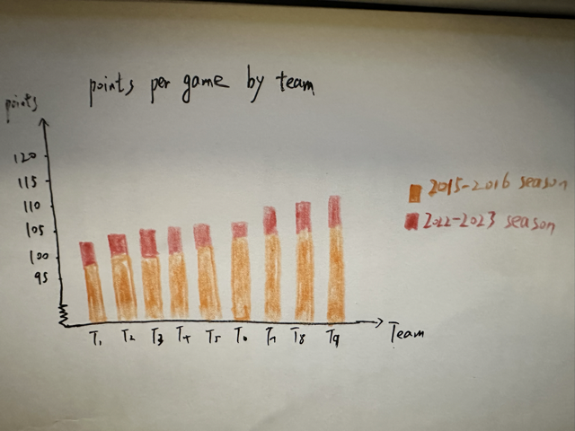

| [home page](https://cmustudent.github.io/tswd-portfolio-templates/) | [visualizing debt](visualizing-government-debt) | [critique by design](critique-by-design) | [final project I](final-project-part-one) | [final project II](final-project-part-two) | [final project III](final-project-part-three) |
# Why have NBA teams significantly improved their scoring over the past few decades?

# Outline

## Overview
Over the past decade, NBA teams have shown a significant improvement in scoring. In the 2022–23 season, the average points per game (PPG) reached a historic high of 114.2 points. To gain a deeper understanding of the evolving trends in basketball, this final project aims to analyze statistical data and identify correlations between points and independent variables.

## Project Structure

### 1. Overview
(1) PPG of the entire league from 2013 to 2023

(2) PPG of the Golden State Warriors from 2013 to 2023

(3) PPG by team in the 2022-2023 and 2015-2016 seasons

### 2. Factors Contributing to Scoring Increase
(1) 3-point and perimeter shot data from 2013 to 2023

(2) Number of rounds from 2013 to 2023

(3) Hit rate of 2-point and 3-point shots from 2013 to 2023

(4) Number of fouls from 2013 to 2023

### 3. Reasons behind this Phenomenon
(1) Development of big data and the role of data analysts

(2) Match rules and the influence of referees

(3) Characteristics of players

### 4. Influences of this Phenomenon
(1) Global market and revenue

(2) Audience ratings

## Initial sketches

# The data

1. Teams statistical data: [NBA official website](https://www.nba.com/stats/teams/traditional?sort=PTS&dir=-1&SeasonType=Playoffs&Season=2022-23)
The NBA's official website contains plenty of statistical data on every team in every season. With this website, I can crawl specific data like 3-point attempts, turnovers, and personal fouls that are potential independent variables.

2. average points per game by year: [SportsKeeda](https://www.sportskeeda.com/basketball/what-average-points-per-game-ppg-nba-year-looking-last-decade-evolution-scoring)
This website lists PPGs for each year. With its help, I will not have to write code by myself to get this data.

3. NBA revenue: [Statista](https://www.statista.com/statistics/193467/total-league-revenue-of-the-nba-since-2005/)
This website contains financial data, which is useful when analyzing the influence behind this trend

# Method and medium
> In a few sentences, you should document how you plan on completing your final project. 

Text here...
